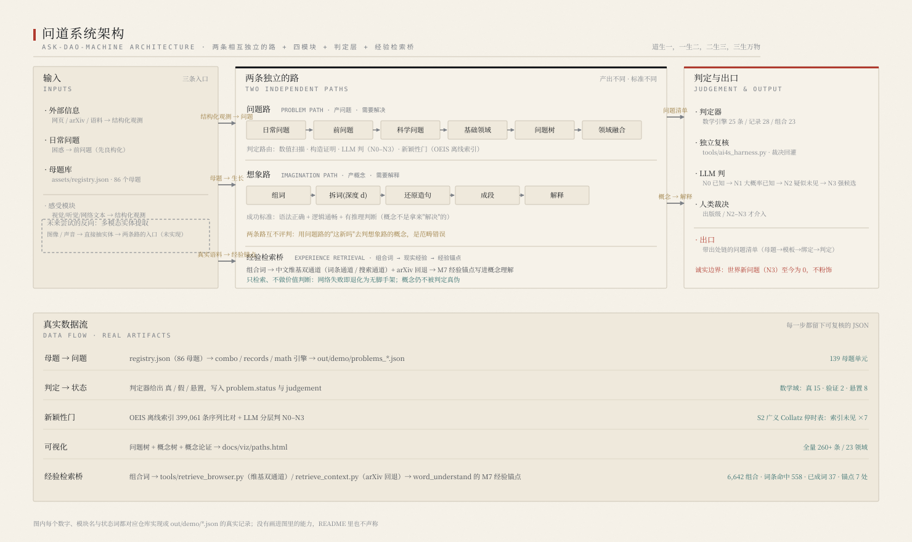
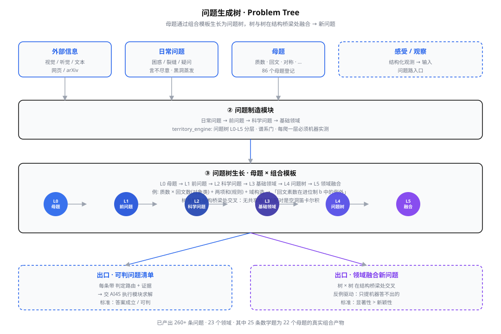

<div align="center">

<picture>
  <source media="(prefers-color-scheme: dark)" srcset="assets/logo_white.png">
  
</picture>

# 问道 · ask-dao-machine

**道生一，一生二，二生三，三生万物**

不是问答机，也不是单纯的问题制造机 —— 它是一台**知识发现机器**

[](https://www.python.org/)
[](LICENSE)
[](CHANGELOG.md)
[](https://shikunpneg.github.io/ask-dao-machine/)
[](#快速开始)

</div>

---

## 📖 目录

- [项目目的：发现新知识](#项目目的发现新知识)
- [什么是新知识](#什么是新知识)
- [系统架构：两条路](#系统架构两条路)
- [问题生成树](#问题生成树)
- [可视化：问题树与概念树](#可视化问题树与概念树)
- [结果与证据](#结果与证据)
- [快速开始](#快速开始)
- [使用文档](#使用文档)
- [目录结构](#目录结构)
- [诚实边界](#诚实边界)

---

## 项目目的：发现新知识

> **这台机器只做一件事：发现新知识。**

已有的 AI4S（AI for Science）生态擅长**解决问题**——给定问题，它能算出答案。
但"问题从哪来"这一环长期空缺：**能定义问题、提出问题的系统，远比能解题的系统稀缺。**

问道补的正是这一环。它认为知识产出于**两条独立的路**：

| | 问题路 · Problem Path | 想象路 · Imagination Path |
|---|---|---|
| **产出** | 问题 | 概念 |
| **需要** | **解决** | **解释** |
| **成功标准** | 答案成立 / 可判 | 语法正确 + 逻辑通畅 + 有推理判断 |
| **输入** | 外部信息 · 日常问题 · 母题 | 词 |

两条路**互相独立**。想象路造出的概念**不是拿来"解决"的**，而是拿来**"理解"**的——
用问题路的逻辑（"这有真实所指吗""这新吗"）去评判想象路的概念，是范畴错误。

---

## 什么是新知识

我们反复重定义过"新"。最终确立**三层问题发现模式**和**两种新知识产生方式**：

| 三层问题发现模式 | 是什么 | 机器能做到 |
|---|---|---|
| **K1 提出问题** | 把困惑改造成**精确可判**的问题 | ✅ |
| **K2 推进解答** | 对旧问题给出更强证据 / 更大边界 | ✅ |
| **K3 归纳理论** | 从数据归纳出可验证的普遍律 | ⚠️ 部分 |

| 两种新知识产生方式 | 说明 |
|---|---|
| **① 提出新问题** | 爱因斯坦的追光思想实验不是解答，是问题——但它改变了物理 |
| **② 旧问题的新解答** | `回文数+素数` 从 10⁶ 推到 **10⁸ 零例外**——这是新知识 |

> 早期只用"K3 且人类未知"（N3）当唯一及格线，于是把 K1/K2 的实际产出当成"不够格"。这是错的。

**"新"的三种形态**：

```
陈述新  —— 这个句子没出现过        （廉价：换个说法就算新）
对象新  —— 这个结构没被研究过      （可造：但查证后常被占领）
接口新  —— 问题站在刚被解锁的节点上 （稀缺：科学史大问题的真实产地）
```

> 真正的大问题不是"没人问过"，而是"**问不出来**"——它在某个节点之前，
> 既没有问它的动机，也没有答它的工具。

---

## 系统架构：两条路



```
┌──────────────────────────────────────────────────────────────────────────┐
│  问题路 (Problem Path)  ——  产问题，需解决                                  │
│                                                                          │
│   输入: 外部信息(视觉/听觉/文本) │ 日常问题 │ 母题                           │
│   流水: 日常问题 → 前问题 → 科学问题 → 基础领域 → 问题树 → 领域融合           │
│   出口: 可判问题清单(带判定路由) → AI4S 执行模块                             │
└──────────────────────────────────────────────────────────────────────────┘
                                    ↑
┌──────────────────────────────────────────────────────────────────────────┐
│  想象路 (Imagination Path)  ——  产概念，需解释                              │
│                                                                          │
│   输入: 词                                                                │
│   流水: 组词 → 拆词(深度d) → 还原造句(嵌套/推理/判断/比较) → 成段 → 解释      │
│   出口: 被理解的概念 / 理论                                                │
│   原则: 每个词都有意义，只不过是我们缺少想象力，无法理解它。                   │
└──────────────────────────────────────────────────────────────────────────┘
```

### 输入 → 输出（按代码核对）

| 输入 | 入口 | 产出 |
|---|---|---|
| 经验（图像） | `python -m ask_dao_machine perceive 图片/` | 结构特征 → 带判定路由的视觉问题 |
| 日常问题 | `python tools/run_paths.py problem --input daily --q "…"` | 判定路由 → 科学问题 |
| 已知未解 | `python tools/scihist_to_problems.py` · `problem_lineage.py` | 正式问题 + 谱系（前问题/后代/侧枝） |
| 母题（86 个） | `python -m ask_dao_machine all` | 问题树：母题 → 前问题 → 科学问题 → 基础领域 → 问题树 L0–L5 → 领域融合 |
| 造词 | `python tools/run_paths.py imagine --word 记忆调性` | 概念（组词 → 拆词(d) → 还原造句 → 成段 → 解释） |
| 论文 / 语料 | `python -m ask_dao_machine paper papers/` | 问题清单（「作者已提出」与「机器新提出」分开标注） |

**输出**：① 问题清单（`problems_*.json` / `discovery_manifest.json`，主产物）
② 概念/理论草稿（`word_*.json` / `sentence_batch.json`）
③ 判定结果与证据推进（`harness_verdicts.json` / `novelty_report.json`）
④ 报告与可视化（`REPORT.md` / `docs/viz/paths.html`）。

> **论文是输入，不是输出**——机器不写论文。且世界新问题（N3）至今为 0：
> 输出的是**候选问题**与**证据边界推进**，不是"已确认的新知识"。

### 关键引擎

| 引擎 | 作用 | 纪律 |
|---|---|---|
| `counterex_engine` | 反例驱动：从例外集长出机器**答不出**的问题 | 只提机器结算不了的问题 |
| `territory_engine` | 问题树 L0–L5 分层 + 谱系门 | 每爬一层必须机器实测 |
| `novelty_gate` | 四道真门：机器真判 → OEIS 实查 → 结构可推性 → 显著性证书 | N3 路径已证明可达 |
| `all_domains_engine` | 14 领域 × 14 进程并行扫描 | 全领域覆盖 |
| `field_fusion` | 领域级融合（含**结构桥梁**判据） | 无共享结构的配对是空洞笛卡尔积 |

---

## 问题生成树



**母题**通过组合模板生长为**问题树**，树与树在结构桥梁处交叉融合 → 新问题。
问题路分五步（`territory_engine`）：**母题 → 前问题 → 科学问题 → 基础领域 → 问题树 → 领域融合**，
每一步都必须机器实测，不许空转。

---

## 可视化：问题树与概念树

生成自包含的交互页面（双击即可打开，无需服务器）：

```bash
python tools/build_paths_viz.py     # → docs/viz/paths.html（入库）与 out/demo/viz/paths.html
```

📄 **[打开可视化 →](docs/viz/paths.html)**

页面包含四个部分：

| 部分 | 内容 |
|---|---|
| **一、两条路** | 问题路 / 想象路 的输入、流水、出口、标准 |
| **二、问题树** | 260+ 条问题，按 23 个领域分组，每条带**判定路由**与状态徽章 |
| **三、概念树** | 9 个概念按**深度 d** 拆解到原子概念（如"记忆调性"→ 过去/影响/现在/主音/音级/偏离/回归） |
| **四、概念论证** | 定义 → **据此可以推断** → **但必须区分** → 因此 |

> 范例（概念论证）：
> **记忆调性**，若是一个真实概念，指的是：记忆不是平铺的档案，而是围绕某些"主音"组织。
> **据此可以推断**：失忆不是记忆的"丢失"，而是记忆的"调性崩溃"。
> **更进一步**：记忆有调性，恰恰保证了人类能更高效地分配精力。
> **但必须区分**：失忆症是一种疾病，而记忆调性是正常现象——正如"心律失常"是病，"心跳有节律"是正常。
> **因此**，记忆调性回答"正常记忆如何组织"，失忆症回答"组织被摧毁时发生什么"。

---

## 结果与证据

### 一、证据边界推进（最扎实）

**`回文数(base b) + 素数` 覆盖** —— 到 10⁷ 的例外：

| base | 例外数 | 最后例外 | 状态 |
|---|---|---|---|
| **4** | **5** | 4345 | ✅ confirmed |
| **5** | **4** | 1266 | ✅ confirmed |
| **6** | **1** | 1855 | ✅ confirmed |
| **7/8/10/12/15** | **0** | — | ✅ confirmed |
| **9/11/13/14/16** | **1** | 124/126/126/540/539 | ✅ confirmed |
| 2 | 持续增长 | 贴边界 | ❌ rejected |

> **base 10 已推到 10⁸ 零例外，两种独立实现交叉验证。**
> 人类讨论此前止于 ~10⁶（MO #250504 曾怀疑 999999 是反例）。

### 二、机器产出的问题

| 来源 | 数量 |
|---|---|
| 跨进制规律 | 15 |
| 反例驱动（机器答不出的） | 11 |
| 跨域组合 | 7 |
| 科学史未解 | 32 |
| 网页 / arXiv | ~30 |
| **合计** | **260+** |

**科学史挖出的真未解**：奇完全数 · 曲线与直线比较 · 欧拉-哥德巴赫 …

### 三、复核性结果（机器重发现）

| 项目 | 机器 | 已知 |
|---|---|---|
| Tn/TnI 集合类 | **224** | Forte 224 ✓ |
| 最大熵集合类 | 恰 2 个 | all-interval tetrachords ✓ |
| 多完全数 k=2,3,4 | {6,28,496,8128} / {120,672,523776} / {30240,32760} | OEIS A007539 ✓ |

### 四、想象路产出的概念

| 概念 | 核心判断 |
|---|---|
| **记忆调性** | 失忆 = 调性崩溃；记忆调性保证精力分配 |
| **认知压缩** | 理解与失真是同一硬币两面；直觉 = 解压最快路径 |
| **责任催化** | 问责 = 最强催化剂；责任爆炸的临界点 |
| **资本反馈** | 反馈强度决定财富分布形态 |

📋 [结果与证据（含负结果与 12 次自纠错）→](docs/guide/results.md)

---

## 快速开始

```bash
git clone https://github.com/shikunpneg/ask-dao-machine && cd ask-dao-machine
export PYTHONPATH=src          # Windows PowerShell: $env:PYTHONPATH='src'
```

```bash
# ① 全引擎 + 可视化 + 新颖性门
python -m ask_dao_machine all --out out/demo
```

```bash
# ② 问题路：日常问题 → 科学问题
python tools/run_paths.py problem --input daily --q "为什么黑洞会蒸发?"
```

```bash
# ③ 想象路：词 → 五步（组词/拆词/还原造句/成段/解释）
python tools/run_paths.py imagine --word 记忆调性 --depth 3
```

```bash
# ④ 可视化：问题树 + 概念树 + 概念论证
python tools/build_paths_viz.py     # → docs/viz/paths.html

# ⑤ 输入论文 → 输出问题（支持 md/txt/pdf/docx/epub 或目录）
python -m ask_dao_machine paper papers/ --out out/papers
#    产出含两类标注：「作者已提出（作者自陈的开放点）」与「机器新提出」
#    GitHub 上：把论文放进 papers/ 推送即可，见 .github/workflows/paper-to-problems.yml

# ⑥ 一页人话汇总（跑完先看这个，不用自己翻 10 个 JSON）
python -m ask_dao_machine report --out out/demo   # → out/demo/REPORT.md

# ⑦ 参照系（新颖性门要用；约 32MB，来自 oeis.org）
python -m ask_dao_machine data fetch              # → data/stripped.gz
python -m ask_dao_machine doctor                  # 环境自查：缺什么、下一步做什么
```

```bash
# 开发/测试（pytest 在 dev 附加依赖里）
pip install -e ".[dev]" && pytest -q
```

---

## 使用文档

| 手册 | 内容 |
|---|---|
| [**架构详解**](docs/guide/architecture.md) | 四模块 / 两条路 / 关键设计决策 |
| [**问题路手册**](docs/guide/problem-path.md) | 三种输入 / 反例驱动 / 问题树 L0–L5 / 新颖性门 |
| [**想象路手册**](docs/guide/imagination-path.md) | 五步流程 / 深度变量 d / 成段范例 / 常见误区 |
| [**什么算新知识**](docs/guide/new-knowledge.md) | 三层问题发现模式 / 两种新知识产生方式 / 显著性 |
| [**AI4S 接口**](docs/guide/ai4s.md) | 问题清单格式 / 裁决回灌 / 闭环 |
| [**结果与证据**](docs/guide/results.md) | 全部可复核数字 |
| [**诚实边界**](docs/guide/honesty.md) | 四条硬边界 / 血泪教训 |
| [**术语表**](docs/guide/glossary.md) | 全部术语 |

---

## 想象路的核心原则

> **每个词都有意义，只不过是我们缺少想象力，无法理解它。**

因此**不存在空想**。任何组合词都有意义 —— 任务不是判断"有没有意义"，
而是**想出一个自洽的理解**。

**成段范例（记忆调性）**：

> 记忆调性，若是一个真实概念，指的是：记忆不是平铺的档案，而是围绕某些"主音"组织。
> **据此可以推断**：失忆不是记忆的"丢失"，而是记忆的"调性崩溃"。
> **更进一步**：记忆有调性，恰恰保证了人类能更高效地分配精力。
> **但必须区分**：失忆症是一种疾病，而记忆调性是正常现象 —— 正如"心律失常"是病，"心跳有节律"是正常。
> **因此**，记忆调性回答"正常记忆如何组织"，失忆症回答"组织被摧毁时发生什么"。

---

## 目录结构

```
ask-dao-machine/
├── assets/                     # logo（书法「道」）+ 架构图 + 问题生成树图
│   ├── logo.png                # 书法「道」logo
│   ├── architecture.svg        # 系统架构图
│   └── problem_tree.svg        # 问题生成树图
├── src/ask_dao_machine/        # 包：引擎 / 判定器 / 母题库 / 可视化 / CLI
├── tools/                      # ~100 个工具（两条路的引擎与探针）
├── docs/
│   ├── index.md                # GitHub Pages 首页
│   ├── guide/                  # ← 使用手册（9 篇）
│   ├── viz/                    # 可视化（paths.html）
│   └── *.md                    # 实验史 / 执行日志 / 长程计划
├── tests/                      # 冒烟测试
└── handoff/                    # 交接包
```

---

## 诚实边界

1. **N3（世界新问题）至今 = 0。**
   机器能产"真问题""已知·未解问题""参照系未见候选"，但**没有一条通过三重门槛**。
   不许粉饰。

2. **"检索未见" ≠ "新"。**
   手头参照系只有 OEIS + 检索；真正的文献门需要人/联网。

3. **想象路的成功标准是"解释"，不是"真实所指"。**
   不许用问题路的逻辑评判想象路的概念。

4. **显著性 > 新颖性。**
   任选参数的序列同样"OEIS 未见"——过 OEIS 门是廉价的，
   唯一拦得住的是**显著性证书**（具名对象的不变量 + 任意选择扰动下保持）。

5. **验证边界是机器最扎实的产出。**
   例如 `回文数+素数` 已被推到 10⁸ 零例外（人类讨论此前止于 10⁶），
   并用两种独立实现交叉验证。

6. **73% 的产出无法判定。**
   "不可判" ≠ "已排除"。

---

<div align="center">

**问道 · ask-dao-machine** v0.5.0 · MIT License

*道生一，一生二，二生三，三生万物*

</div>
