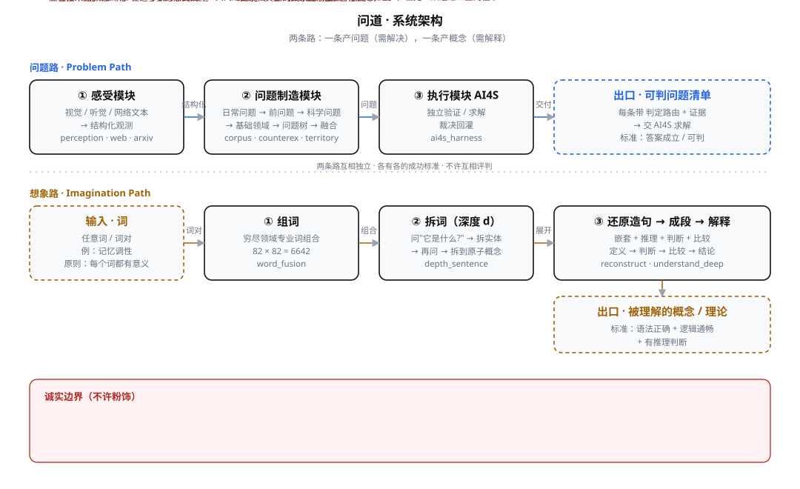

## 两条路

| | 问题路 | 想象路 |
|---|---|---|
| **产出** | 问题 | 概念 |
| **输入** | 外部信息 · 日常问题 · 母题 | 词 |
| **需要** | **解决** | **解释** |
| **成功标准** | 答案成立 / 可判 | 语法正确 + 逻辑通畅 + 有推理判断 |

> ⚠️ 两条路**互相独立**。不许用问题路的逻辑（"这有真实所指吗""这新吗"）
> 去评判想象路的概念 —— 那是**范畴错误**。

---

## 系统架构



```
① 感受模块 ──→ ② 问题制造模块 ──→ ③ 执行模块(AI4S)
 视觉/听觉/文本    日常→前问题→科学问题      (解题)
                  →基础领域→问题树→融合
                        ↑
                  ④ 想象模块 (组词→拆词→还原造句→成段→解释)
```

---

## 想象路的核心原则

> **每个词都有意义，只不过是我们缺少想象力，无法理解它。**

因此**不存在空想**。任何组合词（「记忆调性」「资本反馈」「熵量子化」）都有意义 ——
任务不是判断"有没有意义"，而是**想出一个自洽的理解**。

---

## 什么算新知识

| 层 | 是什么 | 机器能做到 |
|---|---|---|
| **K1 提出问题** | 把困惑改造成**精确可判**的问题 | ✅ |
| **K2 推进解答** | 对旧问题给出更强证据/更大边界 | ✅ |
| **K3 归纳理论** | 从数据归纳出可验证的普遍律 | ⚠️ 部分 |

**两个前提命题**：

1. **提出新问题，本身就是新知识的第一步**（爱因斯坦的追光思想实验不是解答，是问题）
2. **旧问题的新解答，也是新知识**（如 `回文数+素数` 从 10⁶ 推到 **10⁸ 零例外**）

---

## 快速开始

```bash
git clone https://github.com/shikunpneg/ask-dao-machine && cd ask-dao-machine
export PYTHONPATH=src

# 全引擎 + 可视化 + 新颖性门
python -m ask_dao_machine all --out out/demo

# 两条路统一入口
python tools/run_paths.py problem --input daily --q "为什么黑洞会蒸发?"
python tools/run_paths.py imagine --word 记忆调性 --depth 3

# 可视化
python tools/build_paths_viz.py
```

---

## 📖 文档

- [**架构详解**](guide/architecture.html) —— 四个模块 / 两条路 / 关键设计决策
- [**快速开始**](guide/quickstart.html) —— 环境 / 第一次运行 / 常见问题
- [**问题路手册**](guide/problem-path.html) —— 三种输入 / 反例驱动 / 问题树 / 新颖性门
- [**想象路手册**](guide/imagination-path.html) —— 五步流程 / 深度变量 / 成段范例
- [**什么算新知识**](guide/new-knowledge.html) —— K1/K2/K3 / 三种"新" / 显著性
- [**AI4S 接口**](guide/ai4s.html) —— 问题清单格式 / 裁决回灌 / 闭环
- [**结果与证据**](guide/results.html) —— 全部可复核数字 / 负结果 / 自纠错
- [**诚实边界**](guide/honesty.html) —— 四条硬边界 / 血泪教训
- [**术语表**](guide/glossary.html)

## 📊 可视化

- [**两条路全景**](viz/paths.html) —— 问题树 + 概念树 + 概念论证

---

## 诚实边界（先行声明）

1. **N3（世界新问题）至今 = 0** —— 不许粉饰
2. **"检索未见" ≠ "新"** —— 参照系只有 OEIS + 检索
3. **显著性 > 新颖性** —— 过 OEIS 门是廉价的
4. **73% 的产出无法判定** —— "不可判" ≠ "已排除"

---

<div align="center">
<sub>问道 · ask-dao-machine · MIT License</sub>
</div>

