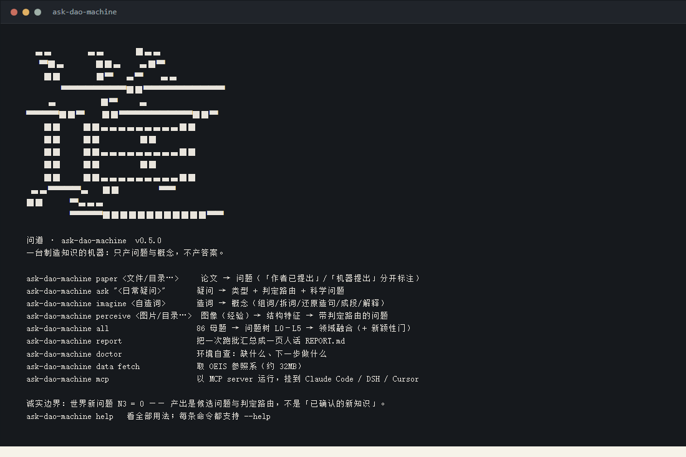

# 命令行 · 清晰、简洁、可复用

装好之后只有一个命令：`ask-dao-machine`（等价 `python -m ask_dao_machine`）。
**直接敲它**进去，看到的是「道」的徽标与命令速查——一眼知道机器开着：



```bash
$ ask-dao-machine
```

## 徽标是怎么来的（不是手绘的）

它把系统字体里「道」的位图取出来，按 1×2 像素合成半块字符（`█ ▀ ▄`），
所以画出来的**就是那个字本身**，不是凭印象画的图案。生成时做了一次反向校验：
字符画还原回位图，与原字体位图**逐点一致**。运行时不需要字体、也不需要 Pillow——
徽标是常量字符串（`src/ask_dao_machine/ui_banner.py`）。

着色只用在徽标上（朱砂 `#b03a2e`），正文一律用**终端默认前景色**加粗/变暗，
所以在浅底与深底终端里都不会出现「看不见的字」。
颜色开关：默认只在 TTY 上色；`NO_COLOR=1` 或 `ASK_DAO_BANNER=0` 关闭；`ASK_DAO_COLOR=1` 强制。

## 命令一览

| 命令 | 输入 → 输出 |
|---|---|
| `ask-dao-machine paper <文件/目录…> [--domain auto\|biomed\|none]` | 论文/语料 → 问题清单（`problems_paper.json` + `REPORT.md`），「作者已提出」与「机器提出」分开标注 |
| `ask-dao-machine ask "<日常疑问>"` | 疑问 → 类型 + `route` 判定路由 + 形式化后的科学问题 |
| `ask-dao-machine imagine <自造词> [--depth d] [--bridge]` | 造词 → 概念（五步；`--bridge` 选择过经验桥） |
| `ask-dao-machine bridge <词A> <词B> [--no-browser]` | 经验桥（可选）：维基双通道 + arXiv 回退 → 经验锚点 |
| `ask-dao-machine perceive <图片/目录…>` | 图像（经验）→ 结构特征 → 带判定路由的问题 |
| `ask-dao-machine all` | 86 母题 → 问题树 L0–L5 → 领域融合（+ 新颖性门） |
| `ask-dao-machine <域> …` | 单域跑批：`aesthetics combo counterex digit_base direction fusion ling math records sparse` |
| `ask-dao-machine report [--out DIR]` | 把一次跑批汇总成一页人话 `REPORT.md` |
| `ask-dao-machine doctor` | 环境自查：Python / 依赖 / 引擎 / 参照系 / 输出目录 / 测试 |
| `ask-dao-machine data fetch [--force]` | 取 OEIS 参照系 → `data/stripped.gz`（约 32MB） |
| `ask-dao-machine mcp` | 以 **MCP server** 运行（stdio），挂到 Claude Code / DSH / Cursor |
| `ask-dao-machine help` · `--version` | 速查 · 版本 |

## 可复用的三条约定

1. **产出永远落在 `--out` 目录**，文件固定：`problems_*.json`（机器可读，每条带 `route`）+
   `REPORT.md`（一页人话）。同一个 `--out` 可以继续接 `report`。
2. **子命令不会打印徽标、不会上色**（只有裸命令与 `help` 会），所以可以直接进管道/脚本：
   ```bash
   ask-dao-machine paper papers/ --out out/p | tail -3
   ```
3. **退出码有含义**：`0` 完成；`2` 参数/路径/格式问题（错误写在 stderr）；`1` 其它失败。
   `ask-dao-machine doctor` 全绿说明这台机器能跑。

## 一条最小工作流（生物医学）

```bash
python tools/fetch_biomed_paper.py --pmcid PMC13331974          # 取开放获取全文
ask-dao-machine paper papers/biomed/PMC13331974.md --domain biomed --out out/biomed_demo
ask-dao-machine report --out out/biomed_demo                    # 一页人话
```

完整回放见 [生物医学完整演示](demo-biomed.md)。

## 与 `tools/` 的关系

CLI 是**入口**，引擎仍在仓库的 `tools/` 与 `src/ask_dao_machine/`：`ask` 与 `imagine` 复用
`tools/question_refiner.py`、`tools/run_paths.py` 的判定器（单一实现，不复制逻辑），
因此这两条命令需要**源码运行或 `pip install -e .`**；`paper` / `perceive` / 引擎跑批在包里自足。
装成裸 wheel 时，`ask` 会明确提示这一点，而不是静默失败。
