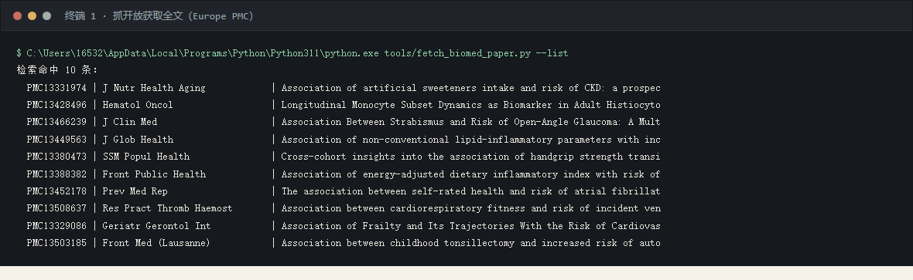
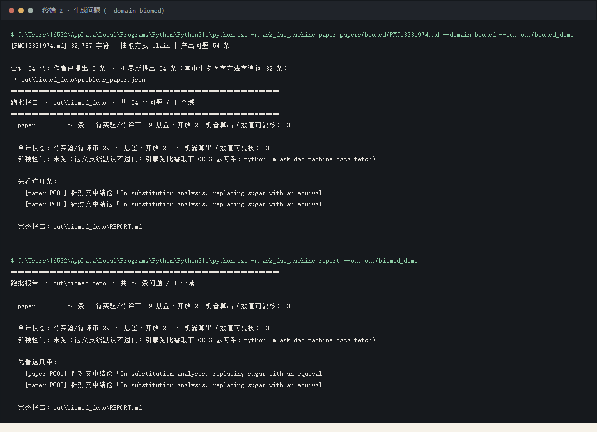
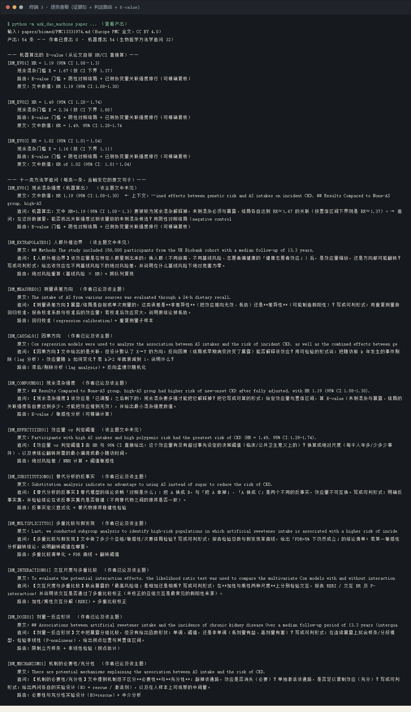
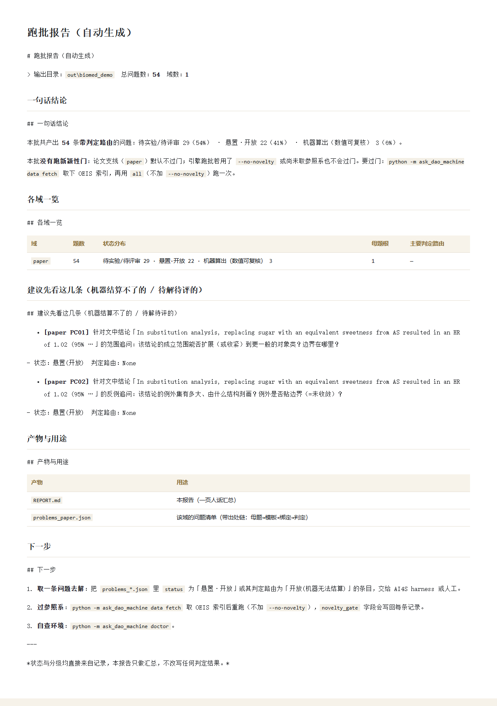

# 生物医学完整演示 · 从论文到问题

> **一次真实的端到端运行**，不是示意图。输入是一篇**开放获取（CC BY 4.0）**的真实论文全文，
> 输出是机器产出的问题清单。所有数字都能用仓库里的同一条命令复现。

## 0. 输入

| 项 | 值 |
|---|---|
| 论文 | *Association of artificial sweeteners intake and risk of CKD: a prospective cohort study* |
| 来源 | Europe PMC `fullTextXML`（全文接口），`PMC13331974` |
| 期刊 / 年份 | J Nutr Health Aging · 2026 · [doi:10.1016/j.jnha.2026.100917](https://doi.org/10.1016/j.jnha.2026.100917) |
| 许可 | **CC BY 4.0**（原样保存于 `papers/biomed/`，元数据见 `PMC13331974.meta.json`） |
| 正文字数 | 32,787 字符（JATS XML → Markdown） |
| 关键设定 | UK Biobank 前瞻队列 · n=156,000 · 中位随访 13.3 年 · 调整后 HR 1.19 (95% CI 1.08–1.30) |

抓取命令（可复现，走的是公开接口）：

```bash
python tools/maintain/fetch_biomed_paper.py        # Europe PMC 检索 → fullTextXML → Markdown
```

## 1. 一条命令

```bash
ask-dao-machine paper papers/biomed/PMC13331974.md --domain biomed --out out/biomed_demo
```

（等价：`python -m ask_dao_machine paper papers/biomed/PMC13331974.md --domain biomed`）

## 2. 输出

```
[PMC13331974.md] 32,787 字符 | 抽取方式=plain | 产出问题 54 条
合计 54 条：作者已提出 0 条 · 机器新提出 54 条（其中生物医学方法学追问 32 条）
→ out/biomed_demo/problems_paper.json（机器可读）+ REPORT.md（一页人话）
```

| 类别 | 条数 | 说明 |
|---|---:|---|
| ②文本张力 | 6 | 抓 `however / yet / inconsistent` 处的分歧，追问"能否在某个前提下统一" |
| ③结构追问 | 16 | 对结论句套四类追问（范围 / 反例 / 机制 / 定量） |
| ④生物医学方法学追问 | 32 | 11 类方法学缺口，**每条都带判定路由** |
| 其中**机器算出数值** | 3 | 从论文自报的 HR/CI 算出 E-value 残余混杂门槛 |

**诚实标注（这部分比条数重要）**：

- `作者已提出` = 0 条 —— 指①机制（"open problem / remains unclear"型自陈）一条都没命中，**不是**说作者没有局限讨论。
- 32 条方法学追问里，**23 条的主题作者已在文中论及**（机器只贡献"写成可判形式"），
  **9 条的主题文中未见**（E-value、效应量 vs 决策阈值、人群外推边界）。
  机器对这两种都用同一句话约束自己：**不主张该主题是它首先想到的**。

## 3. 十一个方法学缺口，各看一条（证据句都来自原文）

| 规则 | 触发它的原文句子（节选） | 机器追问的核心 | 判定路由 |
|---|---|---|---|
| 因果方向 | "Cox regression models were used to analyze the **association** between AS intakes and the risk of incident CKD…" | 设计默认 X→Y：把随访前 k 年事件剔除（lag 分析），效应量随 k 怎么变？k≥2 年就衰减到 1 意味着什么？ | 滞后分析 + 反向孟德尔随机化 |
| 残余混杂强度 | "…high-AS group had higher risk of new-onset CKD after **fully adjusted**, with HR 1.19 (95% CI:1.08−1.30)." | 残余混杂要多强才能解释掉它？（见第 4 节，已算出数） | E-value / 敏感性分析 |
| 剂量—反应形状 | "Associations between artificial sweetener **intake** and the incidence of CKD…" | 单调、阈值还是非单调？拐点在哪？ | 限制立方样条 + 非线性检验 |
| 人群外推边界 | "The study included 156,000 **participants from the UK Biobank cohort**…" | 换人群后是效应量缩放还是方向翻转？什么基线风险下绝对危害为零？ | 绝对风险重算 + 跨队列复现 |
| 效应量 vs 阈值 | "…had the greatest risk of CKD (**HR = 1.49**, 95% CI:1.28−1.74)." | 超过事先设定的决策阈值了吗？换算成每千人年多少事件？ | 绝对风险差 / NNH + 阈值敏感性 |
| 测量误差方向 | "The intake of AS … was evaluated through a **24-h dietary recall**." | 非差异性（低估）还是差异性（假阳性）？校准后效应变大还是变小？ | 回归校准 + 重复测量子样本 |
| 替代分析的反事实 | "**Substitution analysis** indicate no advantage to using AS instead of sugar…" | "换成 B"与"拿掉 A"是两个反事实，结论在该集合内稳健吗？ | 反事实显式化 + 替代物排序检验 |
| 交互尺度 | "To evaluate the potential **interaction** effects, the likelihood ratio test was used…" | 相加还是相乘？RERI / P-interaction 过了多重比较校正吗？ | RERI 分解 + 多重比较校正 |
| 多重比较 | "Last, we conducted **subgroup analysis** to identify high-risk populations…" | 一共做了多少检验？FDR=5% 下哪些还成立？ | 检验清单化 + FDR 曲线 + 翻转阈值 |
| 机制必要性/充分性 | "There are potential **mechanisms** explaining the association between AS intake and the risk of CKD." | 敲掉通路效应消失吗（必要）？单独激活就够吗（充分）？ | KO + rescue + 中介分析 |
| 机器算出（新增） | 见下节 | 由 HR/CI 直接算残余混杂门槛 | 可精确复核 |

## 4. 真算数的那三条：E-value 残余混杂门槛

机器从论文自报的效应量直接算（公式 `E = RR + √(RR(RR−1))`，用 HR 近似 RR）：

| 论文报告 | E-value（点估计） | E-value（按 CI 下界） | 含义 |
|---|---:|---:|---|
| HR **1.19** (95% CI 1.08–1.30) | **1.67** | 1.37 | 未测混杂必须与暴露、结局**各自**达到 RR≈1.67 的关联，才能把该效应解释为零 |
| HR **1.49** (95% CI 1.28–1.74) | **2.34** | 1.88 | 最高风险组所需的混杂强度更高（更难被混杂解释） |
| HR **1.02** (95% CI 1.01–1.04) | **1.16** | 1.11 | 替代分析那一条几乎任何微弱混杂都能解释掉 —— **这条最脆** |

**必须一起说的前提**：RR 是用 HR 近似的，只在结局不常见时成立（本文 CKD 发病率低，近似可用）；
E-value 是**门槛**，不是"存在这样的混杂"的证据。原文中 `E-value` 出现 **0 次**，
所以这是机器加的东西，不是复述。

## 5. 复现与核对

```bash
ask-dao-machine paper papers/biomed/PMC13331974.md --domain biomed --out out/biomed_demo
python -c "import json;d=json.load(open('out/biomed_demo/problems_paper.json',encoding='utf-8'));print(d['counts'])"
```

要核对某一条，直接看它的 `evidence` 字段（原文句子）与 `route` 字段（怎么判）；
`novelty_note` 会写明机器对这条主张到什么程度。

### 真实回放（本次运行的原始输出）









## 6. 这个演示**不**证明什么

1. **不证明这些问题是"新的"。** 世界新问题（N3）至今 = 0；这里产出的是候选问题与判定路由。
2. **不证明作者没想过。** 11 类里 8 类的主题作者已在文中论及（23/32 条被标 `author_touched`），
   机器加的是"可判形式"（lag 分析、E-value 门槛、RERI 分解、回归校准…）。
3. **不构成临床建议。** HR 与 E-value 是流行病学量的换算，不能推出任何用药/摄入建议。
4. **不替代文献检索。** "文中未见"只表示这份全文里没有，不代表文献里没有。

---
